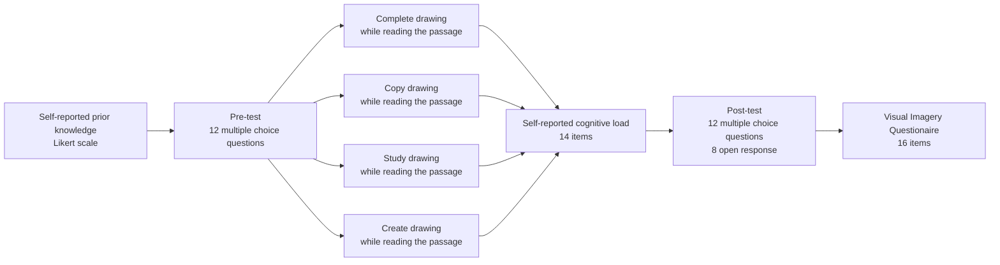

# Summary

Have you ever wondered why images stick in your mind longer than words? Our brains are hardwired to process visual information with remarkable efficiency. Research shows that visual aids not only make learning easier by breaking down complex ideas, but also help illustrate spatial relationships, pinpoint knowledge gaps, and keep us captivated . But what if drawing your own pictures could take learning to the next level, even more than instructor-provided visuals?

Studies reveal that drawing can significantly enhance understanding of how physical systems work. However, its effectiveness hinges on factors like the accuracy of the drawings, the learner’s prior knowledge, and the level of guidance provided while drawing . Beginners often benefit from more structured support . Yet, when dealing with content that doesn’t have a clear visual representation, the precision of these drawings might not matter as much. In these scenarios, student-generated drawings can capture their unique thought processes and create memorable visual snapshots.

In two experiments, college students were randomly assigned to different learning tasks. Some studied or copied an instructor’s drawing, others completed a scaffolded drawing worksheet, and some drew on a blank sheet while reading about abstract concepts or physical systems. The findings were fascinating. When it came to abstract lessons, unguided drawing significantly boosted retention but not transfer. However, for lessons on physical systems, drawing didn’t improve retention or transfer.

These insights suggest that while drawing aids learning, its impact depends on the nature of the content and the context in which it’s used. So next time you’re learning a new abstract concept, consider picking up a pen and sketching it out—you might just find it sticks with you longer.

# Introduction

Visual representations play a crucial role in learning by summarizing verbal information, illustrating spatial relationships, and enhancing memory retention . While educational visuals are typically provided by instructors or textbooks, asking students to create their own drawings is less common . Studying and constructing visuals engage different cognitive processes and can differentially impact learning . It is essential to determine which method most effectively promotes meaningful learning.

Effective learning involves selecting, organizing, and integrating new information with prior knowledge . The more connections learners make between new material and existing knowledge, the better they retain information and the better equipped they are to transfer their knowledge to new context . Thus, an ideal learning strategy encourages the integration of new and prior knowledge.

Multimedia learning, which involves processing both words and pictures, leverages Paivio’s Dual Channel Processing Theory. This theory posits that we process verbal and non-verbal information through separate channels, forming distinct connections between new material and existing knowledge . Drawing integrates these channels by requiring learners to process text and create corresponding visuospatial representations, enhancing cognitive processing and recall .

  

    

        
    

    

        Figure 1. A visual representation of the Cognitive Theory of Multimedia Learning from Multimedia Learning (p. 44), by R.E. Mayer, 2001.
    

Learner-generated drawings are visual representations created by students to achieve educational goal . Generative learning strategies, like drawing, promote long-term understanding by helping learners identify gaps in their knowledge and update their understanding through self-monitoring . Drawing allows students to personalize study materials, addressing individual differences in prior knowledge and learning needs.These drawings can be representational (faithfully depicting physical structures) or non-representational (abstract diagrams and flow charts) . Non-representational drawings may require additional cognitive processing to translate abstract visuals into meaningful content.

Research on learner-generated drawings has yielded mixed results, influenced by factors such as prior knowledge and the level of guidance provided during the drawing process. Early studies showed weak effects favoring drawing to learn. For example, Allesandrini and Rigney (1981) found that drawing or paraphrasing while learning about electrochemistry had varied impacts based on the level of detail . Subsequent studies indicated that drawing without guidance might be too cognitively demanding, detracting from meaningful engagement with the material .

Guided drawing processes, such as providing drawing training or partially completed worksheets, have shown positive learning outcomes. These strategies help learners identify knowledge gaps, reduce cognitive load, and receive feedback on their mental representations .

## Research Focus

Most studies on learner-generated drawings focus on concrete, observable systems. However, not all scientific concepts have definitive visual representations. Topics like dark matter, black holes, and natural selection are either theoretical, unfold over long periods, or lack a physical presence. Our research explores whether the efficacy of drawing to learn depends on the content of the lesson.

    

        
    

    Figure 2. Examples of lesson materials used in previous drawing to learn experiments.

### Hypothesis

We hypothesize that drawing will enhance learning of abstract concepts more effectively than concrete ones. For abstract lessons, we expect learning to increase as students generate more of their own drawings. For concrete lessons, we predict that guided drawing will most benefit learning by reducing cognitive demands.

In summary, our study investigates the impact of drawing on learning abstract and concrete scientific concepts, aiming to identify the most effective strategies for enhancing comprehension and retention.

# Methods

## Experiment 1: Drawing to Learn Abstract Concepts

### Participants

A convenience sample of 238 undergraduate students from the University of California, San Diego were recruited and received partial course credit for their involvement. After controlling for participants who didn't complete the study or failed an attention check, the final sample consisted of 43 males, 165 females, and five non-binary individuals, with a mean age of 20.27 years (SD = 1.93). Participants were randomly assigned to one of four conditions: study (57 participants), copy (54 participants), complete (54 participants), and draw (48 participants).

### Design

We employed a between-subjects factorial design to examine how drawing experiences influenced learning from a lesson on black holes. Participants were randomly assigned to either copy a provided illustration ("copy"), complete a partial illustration ("complete"), freely draw their own illustration ("draw"), or study without drawing ("study"). Learning was assessed through multiple-choice and open-response questions, focusing on both retention and transfer of the lesson content. Additionally, we measured participants' prior knowledge in physics and astronomy, visual imagery ability, and cognitive load during the activity to use as covariates.

### Materials

Materials for the study included a Qualtrics survey, a passage about black holes, supporting illustrations, comprehension tests, and individual difference measures.

- **Prior Knowledge**:

- **Black holes Lesson**: The educational passage, adapted from "The Cosmic Perspective" textbook, was 1,607 words long, covering seven key topics about black holes. Participants in the copy, study, and complete conditions received illustrations created with Adobe Photoshop 2019 and inspired by Pearson Mastering Astronomy and "The Cosmic Perspective." These illustrations depicted features of black holes, Einstein’s Theory of General Relativity, and spacetime distortion.

- **Illustrations**: Custom illustrations, created using Adobe Photoshop 2019, supported the educational passage. These illustrations were inspired by "The Cosmic Perspective" and the Cengage website but were specifically designed for this study. They covered ..INSERT HERE.. Participants in the "complete" condition also received a 334-word instruction sheet for labeling and drawing specific features.

- **Passage Comprehension Tests**: Three types of tests were designed: two analogous 13-question multiple-choice tests, a 4-question open-response retention test, and a 4-question open-response transfer test. The retention and transfer questions required summarizing and applying information from the lesson, respectively. Responses were scored based on identified idea units, with 16 units for retention and 22 for transfer. Two independent coders scored the responses, achieving high inter-rater reliability (retention: INSERT HERE).

  - Example multiple choice retention question: Why do black holes rotate rapidly when they form in the collapse of a rotating star?
  - Example open response retention question: How do black holes form.
  - Example open response transfer test: A star is 6 solar masses. If it were to explode in a supernova what would it produce?

- **Cognitive Load**: Cognitive load was measured using the 10-item instrument developed by , assessing intrinsic, extraneous, and germane load.

- **Spatial Ability**: Spatial ability was assessed using a truncated version of the Paper Folding Test VZ-2, which included 10 items. Participants had to imagine how a folded piece of paper with punched holes would look when unfolded and select the correct answer from multiple choices.

The procedure involved up to four participants at a time, working independently on desktop computers. They first answered demographic and prior knowledge questions, then took one of two counterbalanced multiple-choice pre-tests. Participants then read the black hole passage while engaging in their assigned drawing activity. Instructions varied by condition: study participants examined the provided illustration, copy participants replicated the illustration, complete participants filled in missing parts of an illustration, and draw participants created their own illustrations with guidance from unrelated example drawings.

After the reading and drawing activity, participants rated the lesson’s difficulty and their enjoyment, completed a cognitive load questionnaire, and took a post-test. They then answered open-response questions to assess retention and transfer, followed by the Vividness of Visual Imagery Questionnaire (VVIQ). The cognitive load was measured using a 10-item instrument assessing intrinsic, extraneous, and germane load. Visual imagery ability was assessed with the VVIQ, completed once with eyes open. The experiment concluded with a debriefing on the study’s goals. This detailed procedure allowed us to investigate how different drawing activities affect learning and cognitive processes.

### Results

    

        
    

    

    Figure 1. Caption photos easily. On the left, a road goes through a tunnel. Middle, leaves artistically fall in a hipster photoshoot. Right, in another hipster photoshoot, a lumberjack grasps a handful of pine needles.

    

        
    

    

    Figure 2. Caption photos easily. On the left, a road goes through a tunnel. Middle, leaves artistically fall in a hipster photoshoot. Right, in another hipster photoshoot, a lumberjack grasps a handful of pine needles.

    

        
    

    

    Figure 3. Caption photos easily. On the left, a road goes through a tunnel. Middle, leaves artistically fall in a hipster photoshoot. Right, in another hipster photoshoot, a lumberjack grasps a handful of pine needles.

The purpose of our experiment was to determine if more generative illustration activities would improve retention and transfer of knowledge about black holes. We hypothesized that participants who created their own illustrations would perform better on comprehension measures compared to those who studied provided illustrations. From the initial 238 participants, 213 were included in the final analysis after excluding those who did not engage in the illustration activity, failed attention checks, or did not complete the study.

Participants demonstrated good visual imagery ability (M = 3.761, SD = 0.574) on a scale from 1 to 5, but reported low prior knowledge in physics and astronomy (M = 9.310, SD = 6.813) on a scale from 0 to 50. Their pre-test scores on a multiple-choice test specific to black holes were also low (M = 4.188 out of 12, SD = 1.963). There were no significant differences across conditions for visual imagery ability, self-reported prior knowledge, or pre-test scores, indicating a baseline similarity among participants.

We analyzed the effects of illustration generativity on multiple-choice gains, open-response retention scores, and open-response transfer scores. No significant differences were found in multiple-choice gains or transfer scores across conditions. However, we did observe significant differences in open-response retention scores (F(3,209) = 7.41, p < 0.001). Participants who drew their own illustrations (M = 6.688, SD = 2.93) scored significantly higher on retention compared to those who copied illustrations (M = 4.204, SD = 2.750, p < 0.0001) and those who completed partial illustrations (M = 4.796, SD = 2.595, p = 0.0037). The difference between drawing and studying was near significance (p = 0.052).

### Exploratory Analyses

Additional analyses were conducted to explore mechanisms by which drawing might enhance learning. We examined reading time, cognitive load, condition enjoyment, and word count:

- **Reading Time**: Participants in the drawing condition spent more time engaging with the lesson (M = 16.994 min, SD = 5.809) compared to other conditions (study, copy, complete), which could contribute to their better performance on the retention test. This was confirmed by a significant linear regression (F(1,211)=6.97, p = 0.008), with reading time predicting retention test scores.

- **Cognitive Load**: We found no overall differences in cognitive load across conditions. However, significant differences were observed in extraneous load (F(3,209) = 15.82, p < 0.0001) and germane load (F(3,209) = 6.20, p = 0.0005). Participants in the complete condition reported higher extraneous load, while those in the study condition reported higher germane load compared to other groups.

- **Condition Enjoyment**: Participants in the study condition enjoyed the activity more (M = 3.965, SD = 0.778) than those in other conditions, with significant differences observed between study and complete conditions, and between copy and complete conditions.

- **Word Count**: No significant differences were found in total word count or unique word count across conditions, suggesting that the amount of writing did not account for differences in retention scores.

Overall, our findings indicate that engaging in drawing activities, particularly creating one’s own illustrations, can enhance retention of complex scientific concepts, potentially through increased engagement and effective cognitive processing.

### Results: Experiment 2 - Effectiveness of Guidance in Drawing for Learning About the Change of Seasons

The goal of Experiment 2 was to replicate findings that guidance in drawing benefits learning about a physical system. We hypothesized that retention and transfer performance would be highest in the complete condition due to the most guidance provided, and that drawing from scratch would enhance memory, leading to higher retention and transfer compared to copying and studying conditions. We did not anticipate significant differences between the copying and studying conditions.

After excluding twelve participants who did not participate in the illustration activity or failed attention checks, the final sample size was 229 participants. The participants reported good spatial ability (M = 7.202, SD = 2.091) on a scale from 0 to 10, but low prior knowledge in physics and astronomy (M = 15.60, SD = 6.427) on a scale from 0 to 50. Pre-test multiple-choice scores, measuring prior knowledge specific to the change of the seasons, were also low (M = 6.237 out of 13, SD = 2.556). No significant differences were found across conditions for spatial ability (F(3,224) = 0.87, p = 0.456), self-reported prior knowledge (F(3,224) = 1.18, p = 0.321), or pre-test scores (F(3,224) = 1.27, p = 0.287).

**Test Performance**

We analyzed the effect of illustration generativity (study, copy, complete, draw) on multiple-choice gain scores, open-response retention scores, and open-response transfer scores. There were no significant differences across conditions in multiple-choice gain scores (F(3,224) = 2.59, p = 0.0539) or open-response retention scores (F(3,224) = 0.53, p = 0.6618). This indicates that the generativity of illustrations did not significantly affect these measures of learning.

## Experiment 2 on the Change of Seasons

### Participants

A convenience sample of 240 undergraduate students was recruited from the University of California, San Diego Psychology Subject Pool, and all participants received partial course credit for their participation. Twelve participants were excluded from data analyses due to non-compliance with the study protocol or incomplete data, resulting in a final sample of 229 participants. Of these, 53 identified as male, 173 identified as female, and 2 identified as non-binary. The mean age of participants was 20.504 years (SD = 2.798). Participants were randomly assigned to one of four conditions: study (61 participants), copy (61 participants), complete (60 participants), and draw (46 participants).

### Design

The design of Experiment 2 replicated that of Experiment 1, with the key difference being the measurement of participants' spatial ability instead of visual imagery ability. This between-subjects design manipulated the participants' drawing experience to measure their learning from a lesson on the change of seasons. Participants were assigned to one of four conditions: studying a provided illustration ("study"), copying a provided illustration ("copy"), completing a partial illustration ("complete"), or generating their own illustration ("draw"). Learning outcomes were assessed through multiple-choice and open-response questions designed to measure both retention and transfer of lesson content. Covariates included prior knowledge in physics and astronomy, spatial ability, and cognitive load during the learning activity.

### Materials

The study materials included a Qualtrics survey, an educational passage about the change of seasons, accompanying illustrations, comprehension tests, and measures of individual differences. All materials were presented via a Qualtrics survey accessed online through desktop computers in a lab setting. Participants could not access the entire survey at once and could not change their responses after advancing to the next section. The study was designed to be completed within one hour.

- **Prior Knowledge**: Prior knowledge was assessed using the same measure as in Experiment 1.

- **Seasons Lesson**: Participants read an educational passage adapted from "The Cosmic Perspective" textbook . The passage was modified to fit a one-hour experiment and contained 983 words across seven paragraphs. It covered topics including the cause of the seasons, the role of axis tilt, solstices and equinoxes, and differences between hemispheres. The passage's readability was calculated using the Automated Readability Index (ARI), resulting in an ARI of 12.7, appropriate for the undergraduate sample.

- **Illustrations**: Custom illustrations, created using Adobe Photoshop 2019, supported the educational passage. These illustrations were inspired by "The Cosmic Perspective" and the Cengage website but were specifically designed for this study. They covered the orientation of the Earth's axis during solstices and equinoxes, the relationship between axis tilt and sunlight incidence, and the concentration of sunlight. Participants in the "complete" condition also received a 334-word instruction sheet for labeling and drawing specific features.

- **Passage Comprehension Tests**: Three types of tests were designed: two analogous 13-question multiple-choice tests, a 4-question open-response retention test, and a 4-question open-response transfer test. The multiple-choice tests were constructed by altering the wording of questions while maintaining the same concepts. The retention and transfer questions required summarizing and applying information from the lesson, respectively. Responses were scored based on identified idea units, with 16 units for retention and 22 for transfer. Two independent coders scored the responses, achieving high inter-rater reliability (retention: r(228) = 0.921, p < 0.0001).

- **Cognitive Load**: Cognitive load was measured using the 10-item instrument developed by , assessing intrinsic, extraneous, and germane load.

- **Spatial Ability**: Spatial ability was assessed using a truncated version of the Paper Folding Test VZ-2, which included 10 items. Participants had to imagine how a folded piece of paper with punched holes would look when unfolded and select the correct answer from multiple choices.

### Procedure

Participants completed the study in groups of up to four, each working independently on desktop computers. Random assignment ensured that all participants in a session were in the same condition. A research assistant monitored the session, collected consent forms, and answered questions.

- **Demographics and Prior Knowledge**: Participants provided demographic information and completed the prior knowledge assessment.

- **Pre-test**: Participants took one of two counterbalanced multiple-choice pre-tests.

- **Lesson and Illustration Activity**: Participants read the educational passage and engaged in their assigned illustration activity. Instructions varied by condition:

  - **Study**: Participants examined the provided illustration.
  - **Copy**: Participants replicated the illustration on a new sheet of paper
  - **Complete**: Participants filled in missing information on a scaffolded illustration with detailed instructions.
  - **Draw**: Participants generated their own illustrations based on the passage content.

- **Post-activity Assessments**: Participants rated the lesson's difficulty and their enjoyment of the activity, completed the cognitive load questionnaire, and took the multiple-choice post-test.

- **Open-response Tests**: Participants answered the retention and transfer questions, demonstrating their understanding of the passage.

- **Spatial Ability Test**: Participants completed the Paper Folding Test.

Upon completion, participants were debriefed on the study’s goals. This procedure allowed us to investigate how different drawing activities influence learning and cognitive processing related to the change of seasons.
