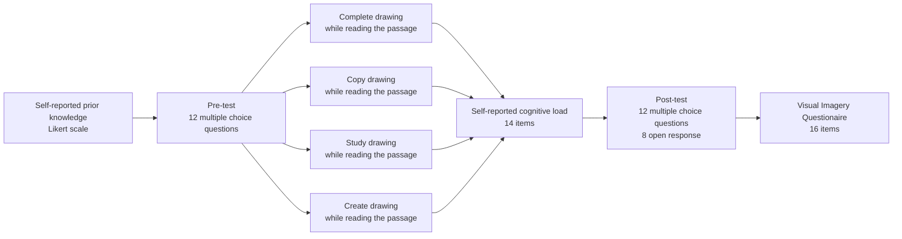

# Summary

Have you ever wondered why images stick in your mind longer than words? Our brains are hardwired to process visual information with remarkable efficiency. Research shows that visual aids not only make learning easier by breaking down complex ideas, but also help illustrate spatial relationships, pinpoint knowledge gaps, and keep us captivated . But what if drawing your own pictures could take learning to the next level, even more than instructor-provided visuals?

Studies reveal that drawing can significantly enhance understanding of how physical systems work. However, its effectiveness hinges on factors like the accuracy of the drawings, the learner’s prior knowledge, and the level of guidance provided while drawing . Beginners often benefit from more structured support as creating accurate drawings from scratch is cognitively demanding and may detract from energy spent learning the material . Yet, when dealing with content that doesn’t have a clear visual representation, the precision of these drawings might not matter as much. In these scenarios, student-generated drawings can capture their unique thought processes and create memorable visual snapshots.

In two experiments, we randomly assigned college students were randomly assigned to different learning tasks. Some studied or copied an instructor’s drawing, others completed a scaffolded drawing worksheet, and some drew on a blank sheet while reading about abstract concepts or physical systems. The findings were fascinating. When it came to abstract lessons, unguided drawing significantly boosted retention but not transfer. However, for lessons on physical systems, drawing didn’t improve retention or transfer.

These insights suggest that while drawing aids learning, its impact depends on the nature of the content and the context in which it’s used. So next time you’re learning a new abstract concept, consider picking up a pen and sketching it out—you might just find it sticks with you longer.

# Introduction

Visual representations play a crucial role in learning by summarizing verbal information, illustrating spatial relationships, and enhancing memory retention . While educational visuals are typically provided by instructors or textbooks, asking students to create their own drawings is less common . Studying and constructing visuals engage different cognitive processes and can differentially impact learning . It is essential to determine which method most effectively promotes meaningful learning.

Effective learning involves selecting, organizing, and integrating new information with prior knowledge . The more connections learners make between new material and their existing knowledge, the better they retain information and transfer it to new contexts . Thus, an ideal learning strategy encourages the integration of new and prior knowledge. While learning can occur through various media (e.g., text, podcasts, pictures), multimedia learning specifically involves processing both words and pictures. This distinction is important because verbal and pictorial information are processed through different cognitive pathways.

    

        
    

    

        Figure 1. A visual representation of the Cognitive Theory of Multimedia Learning from Multimedia Learning .
    

Paivio’s Dual Channel Processing Theory, a well-supported cognitive theory, explains that we process verbal and non-verbal information through separate channels, forming unique connections between new material and our existing knowledge . This theory is particularly relevant to drawing, as it often involves processing both verbal and non-verbal information simultaneously. For example, drawing to understand a passage requires processing the words while organizing a visuospatial representation of the material.

Multimedia learning leverages Paivio’s Dual Channel Processing Theory by engaging both verbal and visual processing channels. When learners draw, they integrate these channels by processing text and creating corresponding visuospatial representations. This integration enhances cognitive processing and recall .

Learner-generated drawings are visual representations created by students to achieve educational goals . Generative learning strategies, like drawing, promote long-term understanding by helping learners identify gaps in their knowledge and update their understanding through self-monitoring . Drawing allows students to personalize study materials, addressing individual differences in prior knowledge and learning needs. These drawings can be representational (faithfully depicting physical structures) or non-representational (abstract diagrams and flow charts) . Non-representational drawings may require additional cognitive processing to translate abstract visuals into meaningful content.

Research on learner-generated drawings has yielded mixed results, influenced by factors such as prior knowledge and the level of guidance provided during the drawing process. Early studies showed weak effects favoring drawing to learn. For example, researchers found that drawing or paraphrasing while learning about electrochemistry had varied impacts based on the level of detail of students' drawings . Subsequent studies indicated that drawing without guidance might be too cognitively demanding, detracting from meaningful engagement with the material . Guided drawing processes, such as providing drawing training or partially completed worksheets, have shown positive learning outcomes. These strategies help learners identify knowledge gaps, reduce cognitive load, and receive feedback on their mental representations .

## Research Focus

Most studies on learner-generated drawings focus on concrete, observable systems. However, not all scientific concepts have definitive visual representations. Topics like dark matter, black holes, and natural selection are either theoretical, unfold over long periods, or lack a physical presence. Our research explores whether the efficacy of drawing to learn depends on the content of the lesson.

    

        
    

    Figure 2. Examples of lesson materials used in previous drawing to learn experiments. All of these studies teach students about physical systems that have a definitive physical representation.

### Hypothesis

We hypothesize that drawing will enhance learning of abstract concepts more effectively than concrete ones. For abstract lessons, we expect learning to increase as students generate more of their own drawings. For concrete lessons, we predict that guided drawing will most benefit learning by reducing cognitive demands.

# Methods

### Participants

A convenience sample of 238 undergraduate students was gathered from the University of California, San Diego Psychology Subject Pool. All participants received partial course credit for their participation. Twenty-five participants were excluded from data analysis, leaving a final sample of 213 participants. Of the 213 participants, 43 identified as male, 165 identified as female, and five identified as non-binary. A majority of participants were in their early twenties with a mean age of 20.27 (SD = 1.93 years). Fifty-seven students participated in the study condition, 54 in the copy condition, 54 in the complete condition, and 48 in the draw condition.

### Design

We used a between-subjects design to manipulate participants' drawing experience and measure their learning from a lesson about black holes. Participants were randomly assigned to one of four drawing conditions, which varied by the degree to which they generated their illustrations: copying a provided illustration (“copy”), completing a partial illustration (“complete”), free drawing their own illustration (“draw”), or a control condition that involved no drawing (“study”). Learning was measured using multiple choice and open response questions designed to assess both the retention and transfer of the lesson content. We also measured participants' prior knowledge about physics and astronomy, their visual imagery ability, and their cognitive load during the learning activity to use as covariates in our analyses. The survey was designed to prevent participants from accessing the entire study at once or revisiting previous sections. While there was no time limit, participants were expected to complete the experiment within an hour.

### Materials

The materials for this study included a Qualtrics survey, a passage about black holes, illustrations to support the passage, passage comprehension tests (multiple choice and open response), and measures of individual differences (prior knowledge, visual imagery ability, cognitive load). All materials were presented to participants via a Qualtrics survey, which they accessed online via desktop computers in a lab setting.

- **Prior Knowledge**: Participants self-reported their knowledge and confidence in physics and astronomy using 5-point Likert scales. The knowledge scale ranged from “I know nothing at all” to “I know a great deal,” and the confidence scale ranged from “not confident at all” to “extremely confident.” The prior knowledge score was calculated by multiplying the knowledge and confidence ratings for both subjects and summing the results.

- **Black holes Lesson**: All participants read an educational passage about black holes, adapted from The Cosmic Perspective textbook . The passage was condensed to 11 paragraphs (1607 words) covering the definition, formation, properties, event horizon, singularity, size, and internal structure of black holes. The readability of the passage was measured using the Automated Readability Index (ARI), resulting in an ARI of 11.30, indicating a grade level of 11.6.

- **Illustrations**: Participants in the copy, study, and complete conditions received illustrations produced using Adobe Photoshop 2019 and Pages. Inspired by The Cosmic Perspective textbook and Pearson Mastering Astronomy platform , the illustrations included drawings of black hole features, Einstein’s Theory of General Relativity, and spacetime distortion near black holes. Scaffolded illustrations featured key elements masked with empty text boxes. Participants in the drawing condition received blank sheets of paper and pens.

- **Passage Comprehension Tests**: Three types of tests were developed: two analogous 15-question multiple-choice tests, one 4-question open response retention test, and one 4-question open response transfer test. The multiple-choice tests included 8 perfect analogs and 7 strong pairs of questions. Retention questions asked students to summarize lesson information, while transfer questions required application of knowledge to new scenarios. Answers were scored based on identified idea units, with inter-rater reliability for retention and transfer tests being r(212)=0.995, p <0.0001 and r(212)=0.798, p <0.0001, respectively.

- **Cognitive Load**: Cognitive load was measured using a 10-item instrument assessing intrinsic, extraneous, and germane load . Participants rated items on a 0 to 10 scale. Examples included “The topics covered in the activity were very complex” (intrinsic load), “The instructions and explanations during the activity were very unclear” (extraneous load), and “The activity really enhanced my understanding of the topics covered” (germane load). Cognitive load was analyzed to determine the impact of visualization strategies on perceived difficulty and mental effort.

- **Visual Imagery**: Visual imagery ability was assessed using the Vividness of Visual Imagery Questionnaire (VVIQ), which asks participants to rate the vividness of imagined scenes on a 5-point Likert scale . The VVIQ was completed once with eyes open.

    

        
    

    

        Figure 4. Example of completed copied drawings from the copy condition. Students assigned to this condition were given an instructor drawing to copy while reading the lesson.
    

    

        
    

    

        Figure 5. Example of completed scaffolded drawings from the complete condition. Students assigned to this condition were asked to fill the blank rectangles to complete the visual representation of the learning material.
    

    

        
    

    

        Figure 6. Example of completed learner-generated drawings from the draw condition. Students assigned to this condition were asked to generate their own visual representation of the learning materials.
    

## Results

The purpose of our experiment was to determine if more generative illustration activities would improve retention and transfer of knowledge about black holes. We hypothesized that participants who created their own illustrations would perform better on comprehension measures compared to those who studied provided illustrations. From the initial 238 participants, 213 were included in the final analysis after excluding those who did not engage in the illustration activity, failed attention checks, or did not complete the study.

Participants demonstrated good visual imagery ability (M = 3.761, SD = 0.574) on a scale from 1 to 5, but reported low prior knowledge in physics and astronomy (M = 9.310, SD = 6.813) on a scale from 0 to 50. Their pre-test scores on a multiple-choice test specific to black holes were also low (M = 4.188 out of 12, SD = 1.963). There were no significant differences across conditions for visual imagery ability, self-reported prior knowledge, or pre-test scores, indicating a baseline similarity among participants.

We analyzed the effects of illustration generativity on multiple-choice gains, open-response retention scores, and open-response transfer scores. No significant differences were found in multiple-choice gains or transfer scores across conditions. However, we did observe significant differences in open-response retention scores (F(3,209) = 7.41, p < 0.001). Participants who drew their own illustrations (M = 6.688, SD = 2.93) scored significantly higher on retention compared to those who copied illustrations (M = 4.204, SD = 2.750, p < 0.0001) and those who completed partial illustrations (M = 4.796, SD = 2.595, p = 0.0037). The difference between drawing and studying was near significance (p = 0.052).

    

        
    

    

        Figure 7. A bar chart demonstrating participants’ multiple-choice gain (post-test minus pre-test) score. Higher scores indicate better performance and maximum possible gain score is 13.
    

    

        
    

    

        Figure 8. A bar chart demonstrating participants’ performance on the open responses retention test organized by condition. Higher scores indicate better performance and the maximum possible score is 22.
    

## Exploratory Analyses

Additional analyses were conducted to explore mechanisms by which drawing might enhance learning. We examined reading time, cognitive load, condition enjoyment, and word count:

- **Reading Time**: Participants in the drawing condition spent more time engaging with the lesson (M = 16.994 min, SD = 5.809) compared to other conditions (study, copy, complete), which could contribute to their better performance on the retention test. This was confirmed by a significant linear regression (F(1,211)=6.97, p = 0.008), with reading time predicting retention test scores.

- **Cognitive Load**: We found no overall differences in cognitive load across conditions. However, significant differences were observed in extraneous load (F(3,209) = 15.82, p < 0.0001) and germane load (F(3,209) = 6.20, p = 0.0005). Participants in the complete condition reported higher extraneous load, while those in the study condition reported higher germane load compared to other groups.

- **Condition Enjoyment**: Participants in the study condition enjoyed the activity more (M = 3.965, SD = 0.778) than those in other conditions, with significant differences observed between study and complete conditions, and between copy and complete conditions.

- **Word Count**: No significant differences were found in total word count or unique word count across conditions, suggesting that the amount of writing did not account for differences in retention scores.

Overall, our findings indicate that engaging in drawing activities, particularly creating one’s own illustrations, can enhance retention of complex scientific concepts, potentially through increased engagement and effective cognitive processing.

## Discussion

The findings of our study suggest that drawing to learn theoretical science can enhance the recall of key points addressed in a passage. Participants in the drawing condition significantly outperformed all other groups on the open response retention test. However, they did not show superior performance on the multiple-choice test or the transfer test compared to other visualization conditions. The most notable difference in performance on the open response retention task was observed between the draw and copy conditions.

These patterns of effects contradict previous findings that suggested students perform better on retention tests when their visualization is guided or inspired by an instructor. While our data indicate that the visualization strategy does not impact students’ transfer ability, it is possible that providing participants in future studies with more time could reveal an effect of visualization strategy. Additionally, exploratory analyses reveal that time spent on the passage may be a crucial factor in supporting retention performance and highlight that self-reported germane load is significantly predicted by the visualization condition.

There are limitations to our study that future research should address. Importantly, a lab setting does not represent true learning environments where students are genuinely motivated to learn. Our participants were volunteers who participated to receive partial course credit, regardless of their performance in the experiment, which means they may not have been genuinely invested in learning about the formation and properties of black holes.

Furthermore, certain visualization tasks may have disproportionately discouraged participants from completing the task. For example, because the study illustration condition requires no active engagement, participants assigned to this condition may have passively scanned the illustrations rather than studying them carefully. Similarly, students assigned to complete an illustration may have found this task odd or elementary, discouraging them from actively completing the worksheet. Feedback from our pilot study suggests that participants did not enjoy completing the illustration and were generally confused by it.

Future studies should test these visualization manipulations in true classroom environments where theoretical science concepts are taught (e.g., advanced physics, astronomy, and evolutionary biology courses). This approach will help determine the effectiveness of drawing as a learning strategy in more realistic and motivating educational settings.

# Acknowledgments

This research was conducted at the University of California, San Diego in the [LIME Lab](https://www.lime-lab-ucsd.com) between 2018 and 2020 and served as my honors thesis project. I would like to extend my heartfelt gratitude to Dr. Geller for providing invaluable mentorship and support throughout my time at UCSD. Your guidance was instrumental in the success of this project and my professional development.
